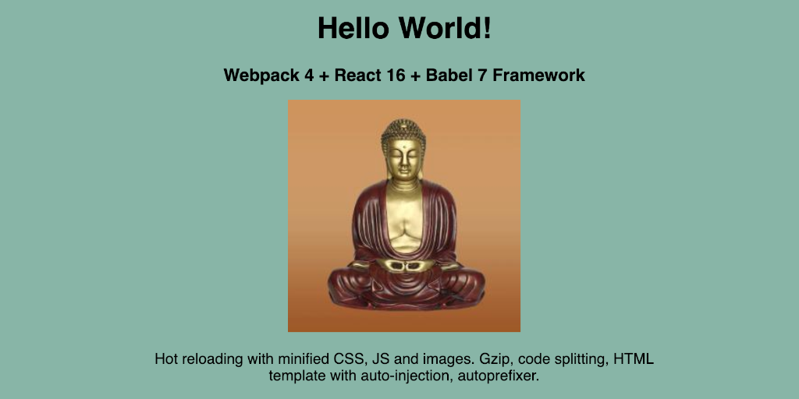

# Webpack 4 + Babel 7 + React 16 Framework

<kbd></kbd>

A front end React framework built with [Webpack](https://webpack.js.org/) v4, Babel 7 and SCSS. The focus is on overall performance by making use of code splitting and minification of HTML, JavaScript, CSS and images. The framework also includes configurations for ESLint, Stylelint and Prettier.

## General Information

This framework was built to easily create performant front end React projects using Webpack v4's built-in compression and minification tools as well as other plugins.

It combines Webpack's [Hot Module Replacement](https://webpack.js.org/concepts/hot-module-replacement/) and [BrowserSync](https://www.browsersync.io/) to get the best functionality of the two.

[Bundle Analyzer](https://www.npmjs.com/package/webpack-bundle-analyzer) is also included (commented out by default) for both production and development modes to test compiled bundle sizes.

A pre-made `index.html` file comes with the framework with auto-injection of CSS and JavaScript links as a part of the build process.

[Autoprefixer](https://github.com/postcss/autoprefixer) is also included within the [PostCSS](https://github.com/postcss/postcss) config file and is set to default browser versions in the `package.json` file.

React v16 is preloaded, as is React Router v4.

## Common Configuration

This framework uses a single `webpack.config.js` file which inserts/toggles functionality based on whether the mode is currently development or production (modes are set in the `package.json scripts`).

It leaves out an entry option due to using `index.js` as an entry point by default.

CSS is compiled down from SCSS using multiple loaders in sequence, including PostCSS with Autoprefixer built in. Smaller images are minimized and inlined as Base64.

[HtmlWebpackPlugin](https://webpack.js.org/plugins/html-webpack-plugin/) is used to inject CSS and JavaScript into an existing `index.html` template file.

## Development Mode

Hot reloading in the browser after any code changes is made available via Webpack's built-in Hot Module Replacement and BrowserSync working together to get the best of both.

Source mapping is provided for both CSS and JavaScript.

## Production Mode

Code splitting is included to separate vendor/dependency code from a project's main JavaScript, and the `[chunkhash]` option is used in production mode filenames for vendor/dependency output files in order to enable cache busting to improve browser loading time.

JavaScript is minimized with help from [UglifyJsPlugin](https://webpack.js.org/plugins/uglifyjs-webpack-plugin/), among other tools, and includes removal of `console.log`s and comments.

CSS is minimized with [MiniCssExtractPlugin](https://webpack.js.org/plugins/mini-css-extract-plugin/) after SCSS is converted to CSS and the code is run thru Autoprefixer via PostCSS, and [cssnano](https://cssnano.co/) via [OptimizeCssAssetsPlugin](https://github.com/NMFR/optimize-css-assets-webpack-plugin).

[CleanWebpackPlugin](https://github.com/johnagan/clean-webpack-plugin) allows for a clean build process without worrying about old files left in the dist folder.

## Compilation "Trees"

### HTML

The included `index.html` file is run thru HtmlWebpackPlugin to inject CSS and Javascript then converted to `gzip` with [CompressionWebpackPlugin](https://webpack.js.org/plugins/compression-webpack-plugin/).

### CSS

SCSS files are converted to CSS, run thru a PostCSS process using Autoprefixer and cssnano, and minified with MiniCssExtractPlugin (in production mode).

### JavaScript

JavaScript is minified with UglifyJsPlugin and converted to `gzip` with CompressionWebpackPlugin.

Vendor, or dependency, code is split out from a project's JavaScript in production mode to improve browser load time and provide for cache busting.

### Version Information

#### 1.1.0

- Added `.eslintrc.json` and `.stylelintrc.json` with support for React, Prettier
- Minor tweaks to `webpack.config.js` due to linting
- Change to `clean-webpack-plugin` syntax in `webpack.config.js` due to semver breaking changes
- Semver breaking changes to several dependencies

#### 1.0.0

- Initial release
